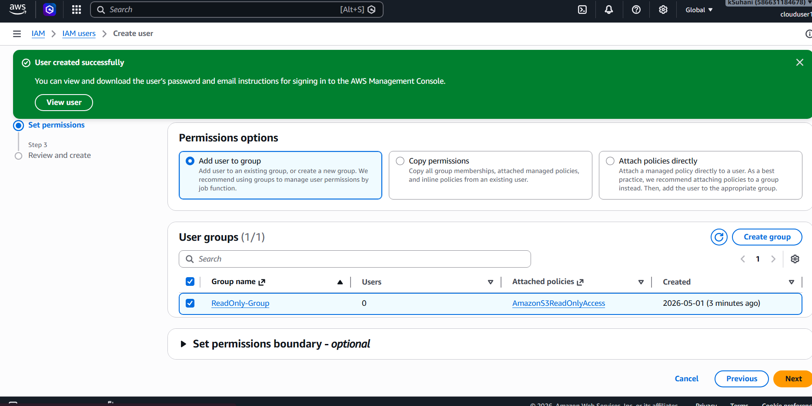
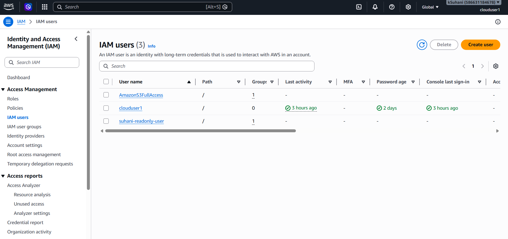

🔐 AWS IAM Access Control — Users, Groups & Policies
A hands-on AWS security project demonstrating Identity and Access Management (IAM) — creating users, groups, and permission policies.

📌 What This Project Does
This project demonstrates how to manage who can access what in AWS using IAM — one of the most critical security concepts in cloud computing. I created two users with different permission levels to show the difference between read-only and full access.

☁️ AWS Services Used

AWS IAM — Identity and Access Management
IAM User Groups — for managing permissions at scale
IAM Policies — AmazonS3ReadOnlyAccess and AmazonS3FullAccess

🛠️ Step-by-Step: What I Built
Step 1 — Created a User Group
Created ReadOnly-Group and attached the AmazonS3ReadOnlyAccess policy — so anyone in this group can only view S3, never modify or delete.
Step 2 — Created Read-Only User
Created suhani-readonly-user and added them to ReadOnly-Group — inheriting read-only S3 permissions through the group.
Step 3 — Created Full Access User
Created AmazonS3FullAccess user with full S3 permissions — can upload, delete, and modify any object.
Step 4 — Compared Both Users
Verified both users exist in IAM with different permission levels — demonstrating the principle of least privilege.

## 📸 Screenshots

💡 What I Learned

Principle of Least Privilege — always give users only the minimum permissions they need
Groups vs Direct Policies — attaching policies to groups is best practice, not to individual users
IAM is the gatekeeper — every AWS action goes through IAM, making it the most important security layer

🔗 Author
Suhani Kadam — Aspiring Cloud & Security Engineer
📧 kadamsuhani29@gmail.com
🐙 github.com/Suhani2929
